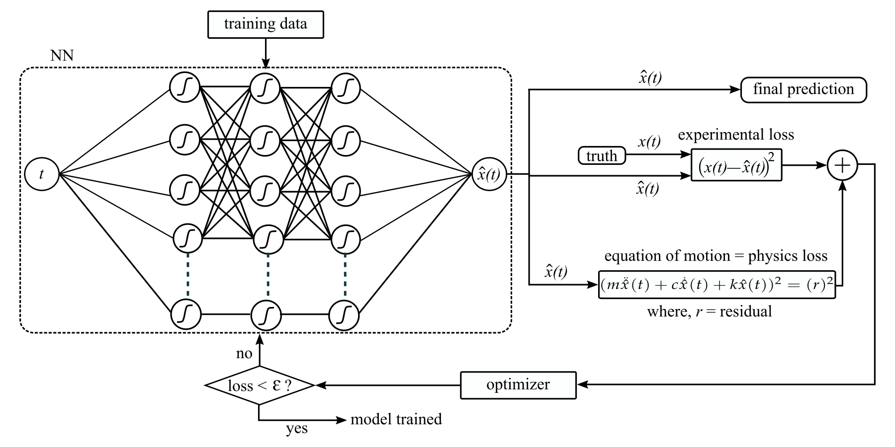
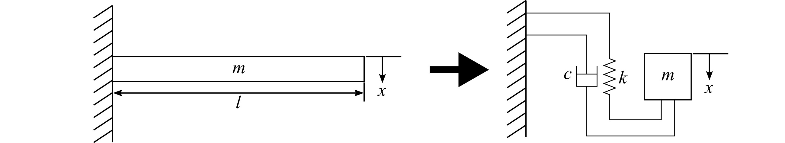
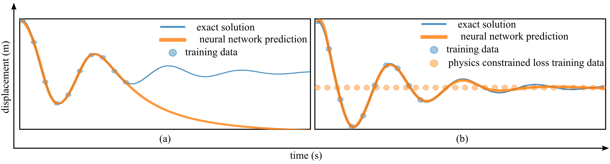

# Physics-Constrained-Machine-Learning-Example
A basic example of one degree of freedom structural dynamics problem that consists of the cantilever beam.

This repository contains code and examples for **Physics-Informed Machine Learning (PIML)** applied to structural response forecasting, as described in the paper "Physics Informed Machine Learning Part II: Applications in Structural Response Forecasting." doi:10.1007/978-3-031-68142-4_8

## Overview

Physics-Informed Machine Learning combines physics principles with machine learning techniques to improve the accuracy and generalizability of predictive models, particularly in structural dynamics and control applications. This repository demonstrates how PIML can solve second-order differential equations (e.g., the equation of motion of a linear structural system) using a physics-constrained neural network.

## Features

- Implementation of physics-constrained loss functions
- Prediction of structural responses using limited training data
- Comparison of standard and physics-informed neural networks

## Figures

### 1. Physics-Constrained Training Process

The total loss function integrates experimental loss and physics loss to improve model generalization.

### 2. One-Degree Freedom Cantilever Beam Model

A one-degree-of-freedom system is modeled as a spring-mass-dashpot system for experimentation.

### 3. Prediction Results with and without Physics Constraints

Comparison of neural network predictions:
- (a) Without physics-constrained loss
- (b) With physics-constrained loss
